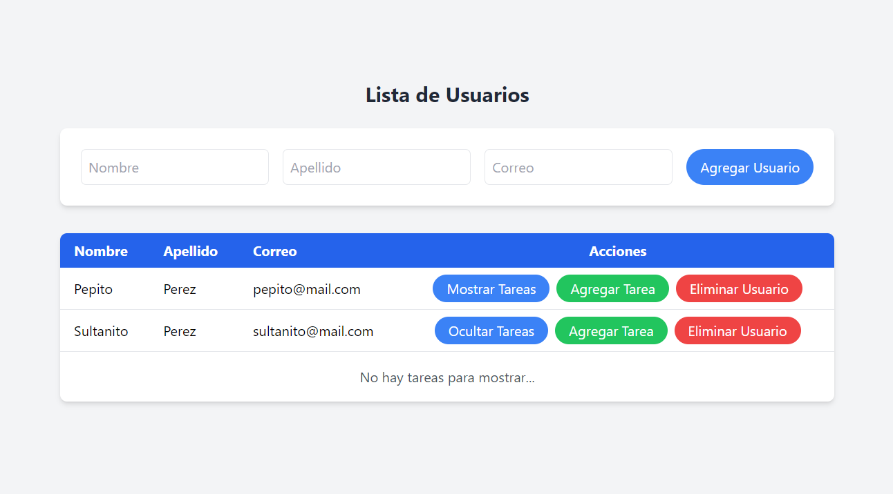
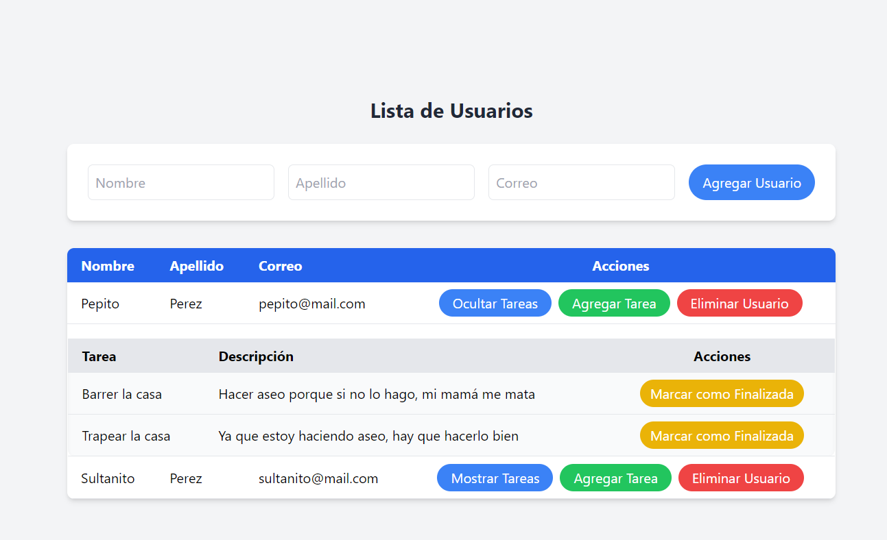
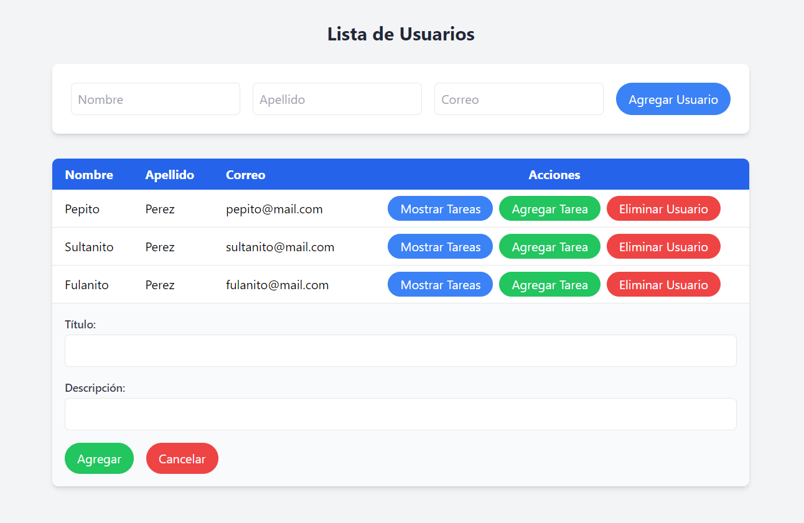

# Users Task List

## Descripción del proyecto

Proyecto sencillo fullstack desarrollado con Golang en el backend y Astro en el frontend. La denámica del sistema es muy sencilla pues consiste en una serie de usuarios que a su vez contiene una lista de tareas que pueden ser marcadas como finalizadas.

Vista básica de un usuario sin tareas


Vista del proyecto con datos lleno


Vista para agregar una tarea a un usuario


## Requisitos del proyecto

Para la ejecución del proyecto hacen falta las siguientes dependencias.

1. Golang 1.21
2. Node.js 20.10.0
3. MySQL 8.X

## Componentes del sistema

### Backend

El proyecto backend fue basado en el proyecto creado por Fazt para posteriormente adaptar una serie de cambios que permitieran el despliegue del código en máquinas virtuales.

Los modelos de la base de datos son los siguientes

- _Usario_: Nombre (string), Apellido (string) y correo (string)
- _Tarea_: Titulo (string), Descripción (string) e ID del usuario (int)

### Frontend

El proyecto frontend fue realizado desde cero con Astro, posteriormente se implementó la integración con React para la codificación del componente "UserList.jsx".

## Ejecución local del proyecto

1. Clonar el repositorio

   ```bash
   git clone https://github.com/Andres-Shadow/Users-Taks-List.git
   ```

2. Crear la base de datos en MySql

   ```bash
   mysql -u root -p
   create database users_tasks
   ```

3. Instalar las depedencias del servidor Backend

   ```bash
   cd backend
   go mod download
   ```

4. Configurar las variables de entorno del servidor Backend

   - Crear el archivo .env al mismo nivel del Main.go
   - Copiar el mismo nombre de las varibales que se encuentran en .env.sample
   - Asignar los valores a las variables de entorno

5. Ejecutar el servidor Backend

   ```bash
   cd backend && go run .
   ```

6. Instalar las dependeicas del servidor frontend

   ```bash
   cd frontend/users_tasks
   npm install
   ```

7. Configurar las variables de entorno del servidor Frontend

   - Crear el arcihvo .env al mismo nivel del package.json
   - Copiar el mismo nombre de las variables que se muestrean en .env.sample
   - Asignar los valores a las variables de entorno

8. Ejecutar el servidor Frontend

   ```bash
   cd frontend/users_tasks && npm run dev
   ```

## Contribuciones

Las contribuciones son bienvenidas. Si deseas contribuir, por favor sigue los siguientes pasos:

1. Haz un fork del repositorio.
2. Crea una nueva rama (`git checkout -b feature/nueva-funcionalidad`).
3. Realiza tus cambios y haz commit (`git commit -am 'Añadir nueva funcionalidad'`).
4. Haz push a la rama (`git push origin feature/nueva-funcionalidad`).
5. Abre un Pull Request.

## Contacto

Para cualquier consulta o sugerencia, puedes contactar a los mantenedores del proyecto a través de:

- [Correo electrónico](mailto:andremadussan@gmail.com)
- [Linkdin](https://www.linkedin.com/in/am-dussanb/)
